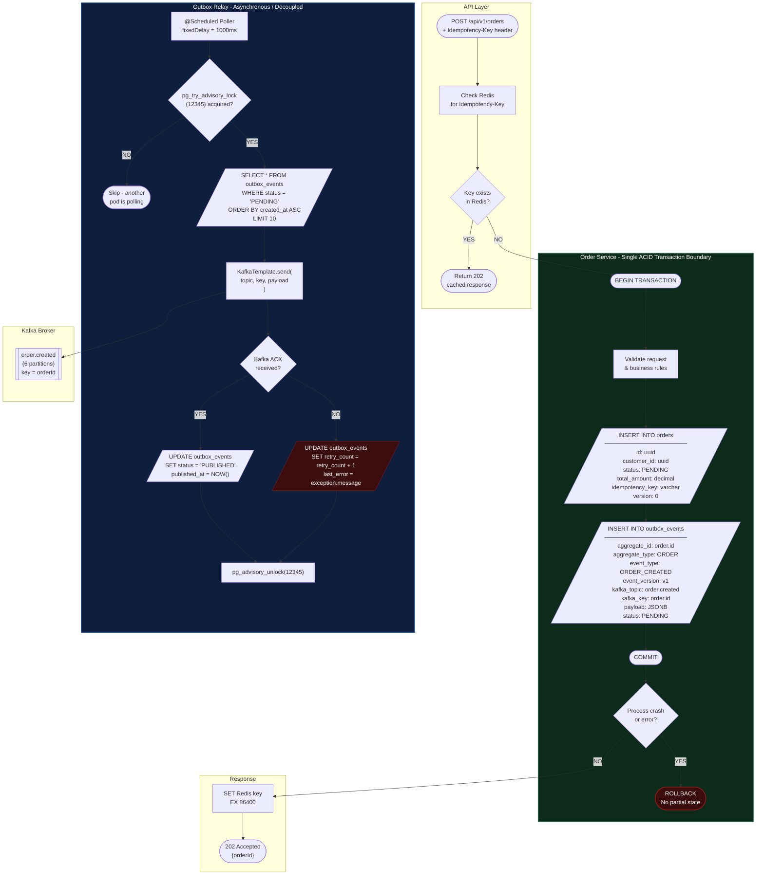
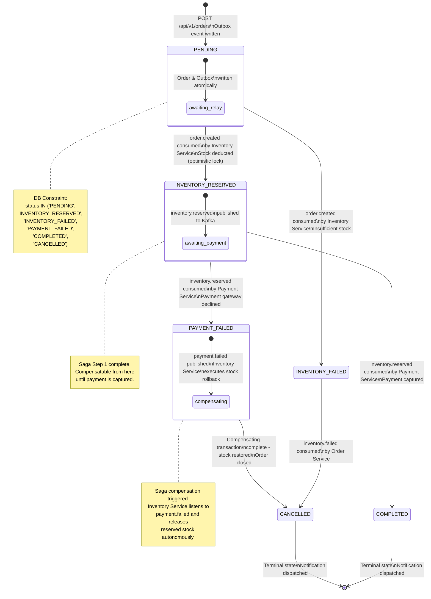

# Order Processing System 

### A Production-Grade Event-Driven Microservices Architecture

---

## Table of Contents

1. [Project Overview](#project-overview)
2. [Architecture Philosophy](#architecture-philosophy)
3. [System Architecture](#system-architecture)
4. [Service Breakdown](#service-breakdown)
5. [Distributed Patterns Deep Dive](#distributed-patterns-deep-dive)
6. [Data Architecture](#data-architecture)
7. [Kafka Topic Design](#kafka-topic-design)
8. [Event Envelope Specification](#event-envelope-specification)
9. [Observability Strategy](#observability-strategy)
10. [Resilience Strategy](#resilience-strategy)
11. [Local Development Setup](#local-development-setup)
12. [API Reference](#api-reference)
13. [Configuration Reference](#configuration-reference)
14. [Tech Stack](#tech-stack)

---

## Project Overview

This system is a fully event-driven, microservices-based order processing platform built to production-grade standards. It handles the complete lifecycle of an e-commerce order - from creation through inventory reservation and payment capture to final confirmation - using asynchronous event choreography across independent, isolated services.

The core engineering challenge this system solves is **distributed consistency without distributed transactions**. Each service owns its data exclusively. No service calls another over HTTP at runtime. Consistency across the system is achieved through the Saga pattern, compensating transactions, and strict idempotency guarantees at every message boundary.

**What this system demonstrates end-to-end:**

- Atomic event publication using the Transactional Outbox Pattern, eliminating the dual-write problem entirely
- Distributed saga choreography across three independent business domains
- Two-layer idempotency (Redis + database constraints) protecting every Kafka consumer from duplicate processing
- Optimistic locking preventing inventory oversell under concurrent load
- Compensating transactions automatically restoring consistency when payment fails
- Full distributed tracing with a single correlation ID flowing from HTTP ingress through every Kafka hop
- Circuit breakers and retry policies preventing cascade failures

---

## Architecture Philosophy

### Why Event-Driven over REST Orchestration

A synchronous REST-based architecture for order processing would require the Order Service to directly call Inventory Service and Payment Service over HTTP. This creates three critical problems:

**Temporal coupling**: if Inventory Service is down, Order Service cannot function - even though creating an order and reserving inventory are logically separable concerns.

**Cascading failures**: a slow Payment Service response blocks Order Service threads, which backs up the request queue, which causes the API Gateway to timeout, which cascades to the client.

**Tight deployment coupling**: every service must be deployed and healthy simultaneously. A rolling deployment of Inventory Service causes failures in Order Service.

The event-driven approach inverts this. Order Service writes its intent to Kafka and returns immediately. Inventory Service processes that intent when it is ready. The two services have zero runtime dependency on each other. Each can be deployed, scaled, and restarted independently.

### Why Choreography over Orchestration

An orchestrated saga requires a central coordinator - typically a dedicated Saga Orchestrator service - that explicitly calls each participant in sequence and manages the overall workflow state. This solves one problem (coordination) while introducing another: the orchestrator becomes a single point of failure and a bottleneck for all order flows.

Choreography distributes the coordination logic into each service. The Inventory Service knows: "when I see an `order.created` event, I reserve stock and publish the outcome." The Payment Service knows: "when I see an `inventory.reserved` event, I process payment." No service has global knowledge. Each service is fully autonomous. The workflow emerges from the combination of reactions.

The tradeoff is that the overall flow is harder to visualise from any single service's code - which is precisely why the sequence diagrams and this documentation exist.

---

## System Architecture

### High-Level Component Topology

```mermaid
graph TB
    subgraph CLIENT["Client Layer"]
        C(["fa:fa-user Client / Mobile App"])
    end

    subgraph GATEWAY["API Gateway Layer  •  Spring Cloud Gateway"]
        GW["API Gateway\n────────────────\n› Route Resolution\n› Rate Limiting (Redis)\n› Correlation ID Injection\n› JWT Validation"]
    end

    subgraph SERVICES["Microservices Layer"]
        direction TB

        subgraph OS_BOX["Order Service  •  :8081"]
            OS["Order Service\n────────────────\n› Create Order\n› Outbox Poller\n› Status Updater"]
        end

        subgraph IS_BOX["Inventory Service  •  :8082"]
            IS["Inventory Service\n────────────────\n› Reserve Stock\n› Release Stock\n› Optimistic Locking"]
        end

        subgraph PS_BOX["Payment Service  •  :8083"]
            PS["Payment Service\n────────────────\n› Process Payment\n› Refund Payment\n› Idempotency Guard"]
        end

        subgraph NS_BOX["Notification Service  •  :8084"]
            NS["Notification Service\n────────────────\n› Email Dispatch\n› SMS Dispatch\n› Terminal Event Listener"]
        end
    end

    subgraph MESSAGING["Messaging Layer  •  Apache Kafka Cluster"]
        direction LR
        T1[["order.created"]]
        T2[["inventory.reserved"]]
        T3[["inventory.failed"]]
        T4[["payment.processed"]]
        T5[["payment.failed"]]
        DLQ1[["inventory.events.DLQ"]]
        DLQ2[["payment.events.DLQ"]]
    end

    subgraph DATA["Data Layer"]
        direction TB

        subgraph ODB["orders_db  •  PostgreSQL :5432"]
            OT[("orders\norder_items\noutbox_events")]
        end

        subgraph IDB["inventory_db  •  PostgreSQL :5433"]
            IT[("products\ninventory_reservations")]
        end

        subgraph PDB["payments_db  •  PostgreSQL :5434"]
            PT[("payments")]
        end

        REDIS[("Redis :6379\n────────────\nIdempotency Keys\nRate Limit Counters")]
    end

    subgraph OBS["Observability Stack"]
        PROM["Prometheus\n:9090"]
        GRAF["Grafana\n:3000"]
        ZIPKIN["Zipkin\n:9411"]
    end

    C -->|"HTTPS + Idempotency-Key header"| GW
    GW -->|"POST /api/v1/orders"| OS
    GW -->|"Rate limit state"| REDIS
    OS -->|"Atomic write\n(same transaction)"| OT
    OS -->|"Publishes via\nOutbox Poller"| T1
    OS -->|"Consumes to\nupdate order status"| T3
    OS -->|"Consumes to\nupdate order status"| T4
    OS -->|"Consumes to\nupdate order status"| T5
    IS -->|"Reads/writes\nstock & reservations"| IT
    IS -->|"Consumes"| T1
    IS -->|"Publishes on success"| T2
    IS -->|"Publishes on failure"| T3
    IS -->|"Consumes for\ncompensating rollback"| T5
    IS -->|"Max retries exceeded"| DLQ1
    PS -->|"Reads/writes\npayment records"| PT
    PS -->|"Consumes"| T2
    PS -->|"Publishes on success"| T4
    PS -->|"Publishes on failure"| T5
    PS -->|"Max retries exceeded"| DLQ2
    NS -->|"Consumes terminal events"| T3
    NS -->|"Consumes terminal events"| T4
    NS -->|"Consumes terminal events"| T5
    IS & PS & NS & OS -->|"Idempotency key\ncheck & store"| REDIS
    OS & IS & PS & NS -->|"Metrics scrape\n/actuator/prometheus"| PROM
    PROM --> GRAF
    OS & IS & PS & NS -->|"Trace spans\nvia Micrometer"| ZIPKIN
```



---

## Service Breakdown

### API Gateway - Port 8080

The single ingress point for all client traffic. Built on Spring Cloud Gateway (reactive, Netty-based - intentionally has no Spring Web dependency).

**Responsibilities:**

- Route resolution: maps incoming paths to the correct downstream service
- Rate limiting: enforces request quotas per IP using Redis as the counter store, preventing any single client from overwhelming the system
- Correlation ID injection: if an incoming request does not carry an `X-Correlation-ID` header, the gateway generates a UUID and injects it - this ID propagates through every downstream service and every Kafka message, making the full request traceable end-to-end in Zipkin
- Idempotency-Key validation: ensures the header is present on state-mutating endpoints before forwarding

**What it does not do:** business logic, database access, or Kafka interaction. It is a pure infrastructure concern.

---

### Order Service - Port 8081

The entry point for business logic. Owns the `orders_db` PostgreSQL instance exclusively.

**Responsibilities:**

- Accept `POST /api/v1/orders` requests
- Validate the request payload and the `Idempotency-Key` header
- Execute the transactional outbox write - the most critical operation in the system
- Run the Outbox Poller on a scheduled basis to relay pending events to Kafka
- Consume terminal-state events from Kafka (`inventory.failed`, `payment.processed`, `payment.failed`) to update the order's status in its own database

**Key design constraint:** Order Service never calls Inventory Service or Payment Service. It publishes its intent and later learns the outcome by consuming events. This means Order Service's API returns `202 Accepted` - not `200 OK` - because the order outcome is not yet known at response time.

**Tables owned:** `orders`, `order_items`, `outbox_events`

---

### Inventory Service - Port 8082

Responsible for stock management. Owns the `inventory_db` PostgreSQL instance exclusively.

**Responsibilities:**

- Consume `order.created` events and attempt to reserve the requested stock
- Use optimistic locking (`@Version` column) on the `products` table to prevent two concurrent reservations from both succeeding when only one unit remains - this is the oversell prevention mechanism
- Publish `inventory.reserved` on success or `inventory.failed` on insufficient stock
- Consume `payment.failed` events and execute the compensating transaction: release the previously reserved stock, restoring inventory to its pre-reservation state

**Key design constraint:** Inventory Service has no knowledge of Payment Service's internals. It reacts to `payment.failed` purely because it has subscribed to that topic. This is the choreography contract - each service knows what events to react to, not which service produced them.

**Tables owned:** `products`, `inventory_reservations`

---

### Payment Service - Port 8083

Responsible for payment capture. Owns the `payments_db` PostgreSQL instance exclusively.

**Responsibilities:**

- Consume `inventory.reserved` events and attempt to process payment
- Insert a payment record before attempting the charge (idempotency: if the same event arrives twice, the UNIQUE constraint on `order_id` prevents a second payment record)
- Publish `payment.processed` on success or `payment.failed` on decline
- Apply idempotency checks via Redis before any processing begins

**Key design constraint:** Payment Service only acts after inventory is confirmed reserved. It never attempts to charge a customer for an order where stock could not be guaranteed.

**Tables owned:** `payments`

---

### Notification Service - Port 8084

A stateless event consumer. Owns no database.

**Responsibilities:**

- Consume all terminal-state events: `inventory.failed`, `payment.processed`, `payment.failed`
- Dispatch mock email and SMS notifications appropriate to each outcome
- Apply retry logic with a DLQ so a transient failure in the notification delivery mechanism does not lose the notification permanently

**Key design constraint:** Notification Service is intentionally kept simple. It is a pure consumer with no outbound Kafka publishing. Its failure has no impact on any other service's operation.

---

## Distributed Patterns Deep Dive

### The Transactional Outbox Pattern



#### The Problem It Solves

The naive approach to publishing events is:

```
1. Save order to PostgreSQL   ← succeeds
2. Publish event to Kafka     ← process crashes here
```

The order exists in the database. The event never reaches Kafka. Inventory Service never sees it. The order is permanently stuck in `PENDING`. The customer receives no outcome. There is no automatic recovery.

The alternative naive approach has the same problem in reverse:

```
1. Publish event to Kafka     ← succeeds
2. Save order to PostgreSQL   ← process crashes here
```

The event is in Kafka. Inventory Service acts on it. But no order record exists. The database and the event stream are inconsistent.

#### How the Outbox Pattern Solves It

The outbox table is a staging area inside the same database as the orders table. Writing to both in a single ACID transaction means they are always consistent with each other - either both writes succeed or neither does. The `outbox_events` table acts as a guaranteed local buffer for events that need to reach Kafka.

The Outbox Poller is a separate, asynchronous concern. It reads from `outbox_events` where `status = PENDING` and publishes to Kafka. Only after receiving a Kafka acknowledgement does it mark the event as `PUBLISHED`. If the poller crashes after publishing but before marking as published, the event is published again on the next poll cycle - meaning Kafka may receive it twice. This is acceptable because all consumers are idempotent: receiving the same event twice produces the same outcome as receiving it once.

#### The Advisory Lock

When Order Service is horizontally scaled to multiple pods, each pod runs its own `@Scheduled` poller. Without coordination, Pod A and Pod B both read the same 10 `PENDING` events and both publish them to Kafka - every event is doubled.

`pg_try_advisory_lock(lockId)` is a PostgreSQL session-level lock that is non-blocking: if the lock is held, it returns `false` immediately rather than waiting. Pod A acquires the lock and begins polling. Pod B calls `pg_try_advisory_lock`, gets `false`, and exits immediately. Pod A finishes its batch and releases the lock. On the next scheduled cycle, either pod may acquire it. This gives you safe horizontal scaling of the poller with zero external infrastructure.

---

### The Saga Pattern - Choreography

```mermaid
sequenceDiagram
    autonumber

    actor Client
    participant GW as API Gateway
    participant OS as Order Service
    participant ODB as orders_db
    participant K as Kafka
    participant IS as Inventory Service
    participant IDB as inventory_db
    participant PS as Payment Service
    participant PDB as payments_db
    participant NS as Notification Service
    participant RD as Redis

    Note over Client, RD: ═══════════════ HAPPY PATH ═══════════════

    Client->>GW: POST /api/v1/orders {Idempotency-Key: uuid}
    GW->>RD: GET idempotency:{key}
    RD-->>GW: null (new request)
    GW->>OS: Forward request

    rect rgb(20, 60, 40)
        Note over OS, ODB: Single ACID Transaction (Outbox Pattern)
        OS->>ODB: INSERT INTO orders (status=PENDING)
        OS->>ODB: INSERT INTO outbox_events (status=PENDING, topic=order.created)
        ODB-->>OS: COMMIT
    end

    OS-->>GW: 202 Accepted {orderId}
    GW->>RD: SET idempotency:{key} = {orderId} EX 86400
    GW-->>Client: 202 Accepted {orderId}

    rect rgb(20, 40, 70)
        Note over OS, K: Async - Outbox Poller (advisory lock held)
        OS->>ODB: SELECT * FROM outbox_events WHERE status=PENDING
        OS->>K: PUBLISH → order.created {orderId, items, amount}
        OS->>ODB: UPDATE outbox_events SET status=PUBLISHED
    end

    K->>IS: CONSUME order.created
    IS->>RD: GET idempotent:inventory:{eventId}
    RD-->>IS: null (not duplicate)

    rect rgb(20, 60, 40)
        Note over IS, IDB: Optimistic Locking - prevents oversell
        IS->>IDB: UPDATE products SET qty = qty - N WHERE version = V
        IDB-->>IS: 1 row updated (version bumped)
        IS->>IDB: INSERT INTO inventory_reservations (order_id, status=RESERVED)
    end

    IS->>RD: SET idempotent:inventory:{eventId} EX 86400
    IS->>K: PUBLISH → inventory.reserved {orderId}

    K->>PS: CONSUME inventory.reserved
    PS->>RD: GET idempotent:payment:{eventId}
    RD-->>PS: null (not duplicate)

    rect rgb(20, 60, 40)
        Note over PS, PDB: Payment Processing
        PS->>PDB: INSERT INTO payments (order_id, status=PENDING)
        Note over PS: Call payment gateway (mocked)
        PS->>PDB: UPDATE payments SET status=SUCCESS
    end

    PS->>RD: SET idempotent:payment:{eventId} EX 86400
    PS->>K: PUBLISH → payment.processed {orderId}

    K->>OS: CONSUME payment.processed
    OS->>ODB: UPDATE orders SET status=COMPLETED

    K->>NS: CONSUME payment.processed
    NS-->>Client: 📧 "Your order has been confirmed!"

    Note over Client, RD: ════════ COMPENSATING TRANSACTION PATH (Payment Failure) ════════

    PS->>PDB: UPDATE payments SET status=FAILED, reason=DECLINED
    PS->>K: PUBLISH → payment.failed {orderId, reason}

    K->>IS: CONSUME payment.failed
    Note over IS: Compensating Transaction - Rollback Stock

    rect rgb(80, 20, 20)
        IS->>IDB: UPDATE products SET qty = qty + N (stock restored)
        IS->>IDB: UPDATE inventory_reservations SET status=RELEASED
    end

    K->>OS: CONSUME payment.failed
    OS->>ODB: UPDATE orders SET status=PAYMENT_FAILED

    K->>NS: CONSUME payment.failed
    NS-->>Client: 📧 "Your payment failed. Please retry."
```



#### Eventual Consistency Explained

When the client receives `202 Accepted`, the order exists in the database with status `PENDING`. The final outcome - `COMPLETED` or `PAYMENT_FAILED` or `CANCELLED` - is determined asynchronously over the next few seconds as events flow through Kafka and each service processes its step.

This means the system is **eventually consistent**: at any point in time, each service's view of the order reflects its local knowledge. Order Service sees `PENDING`. Inventory Service has not yet acted. Payment Service does not know the order exists yet. Over time, as events propagate, all services converge on the same terminal state.

The client is expected to either poll `GET /api/v1/orders/{orderId}` for the final status, or receive a push notification via the Notification Service. This is the fundamental contract of any event-driven system exposed to synchronous clients.

#### Compensating Transactions vs. Rollback

A database rollback is atomic and immediate - it undoes uncommitted work within a single transaction. Compensating transactions are the distributed systems equivalent: they are new forward-moving operations that semantically undo previously committed work.

When Payment Service publishes `payment.failed`, it cannot reach into Inventory Service's database and undo the stock deduction - that was a separate committed transaction in a separate database. Instead, Inventory Service listens to `payment.failed` and executes a new operation: add the stock back, mark the reservation as released. The net effect is equivalent to a rollback, achieved through a new committed transaction.

This is why the order state machine includes `CANCELLED` as a terminal state that is only reached after a compensating transaction completes - it represents a clean, consistent end state, not an abrupt abort.

---

### Idempotency - Two-Layer Defence

Kafka provides at-least-once delivery. Under certain failure conditions - consumer crash after processing but before committing offset, broker leader election, consumer group rebalance - the same message will be delivered more than once. Every consumer in this system must handle this safely.

**Layer 1 - Redis check (fast path):**
Before processing any event, the consumer constructs a key of the form `idempotent:{service}:{eventId}` and checks Redis. If the key exists, the event has already been processed successfully. The consumer logs the duplicate and returns immediately - no database access, no business logic executed.

**Layer 2 - Database UNIQUE constraint (safe path):**
Redis keys have a TTL (24 hours by default). For events delivered after the TTL expires, or in the window between successful processing and Redis key creation, the database constraint is the final guarantee. `inventory_reservations` has a UNIQUE constraint on `order_id`. `payments` has a UNIQUE constraint on `order_id`. An attempt to insert a duplicate raises a constraint violation, which the consumer catches and treats as a successful no-op.

The combination means: fast rejection for the common case (Redis hit), guaranteed correctness for the edge case (DB constraint), with no risk of double-charging a customer or double-reserving stock.

---

## Data Architecture

### Database-per-Service Pattern

Each service has its own PostgreSQL instance. This is not a preference - it is an architectural constraint that enforces service autonomy.

**Enforcement rules:**

- No service's application code imports another service's JPA entities
- No cross-database foreign keys exist anywhere in the system
- No shared schema or shared connection pool
- If Service A needs data owned by Service B, it either receives it in an event payload or calls Service B's API (HTTP, for query-only operations - never for writes)

This means joins across service boundaries do not exist at the database level. If an operator needs a combined view - for example, order details with payment status and inventory status - that view is assembled in the application layer by collecting data from each service's API, or by a dedicated read model service that consumes all events and maintains a denormalised projection.

### Order Service Schema

```sql
CREATE EXTENSION IF NOT EXISTS "uuid-ossp";

CREATE TABLE orders (
    id                  UUID            PRIMARY KEY DEFAULT uuid_generate_v4(),
    customer_id         UUID            NOT NULL,
    idempotency_key     VARCHAR(255)    NOT NULL,
    status              VARCHAR(50)     NOT NULL DEFAULT 'PENDING',
    total_amount        NUMERIC(19, 4)  NOT NULL,
    currency            CHAR(3)         NOT NULL DEFAULT 'INR',
    created_at          TIMESTAMPTZ     NOT NULL DEFAULT NOW(),
    updated_at          TIMESTAMPTZ     NOT NULL DEFAULT NOW(),
    version             BIGINT          NOT NULL DEFAULT 0,
    CONSTRAINT chk_orders_status CHECK (
        status IN ('PENDING', 'INVENTORY_RESERVED', 'INVENTORY_FAILED',
                   'PAYMENT_FAILED', 'COMPLETED', 'CANCELLED')
    ),
    CONSTRAINT uq_orders_idempotency_key UNIQUE (idempotency_key)
);

CREATE TABLE order_items (
    id                  UUID            PRIMARY KEY DEFAULT uuid_generate_v4(),
    order_id            UUID            NOT NULL REFERENCES orders(id) ON DELETE CASCADE,
    product_id          UUID            NOT NULL,
    product_name        VARCHAR(500)    NOT NULL,
    quantity            INT             NOT NULL,
    unit_price          NUMERIC(19, 4)  NOT NULL,
    total_price         NUMERIC(19, 4)  NOT NULL,
    CONSTRAINT chk_order_items_quantity CHECK (quantity > 0)
);

CREATE TABLE outbox_events (
    id                  UUID            PRIMARY KEY DEFAULT uuid_generate_v4(),
    aggregate_id        UUID            NOT NULL,
    aggregate_type      VARCHAR(100)    NOT NULL,
    event_type          VARCHAR(100)    NOT NULL,
    event_version       VARCHAR(10)     NOT NULL DEFAULT 'v1',
    payload             JSONB           NOT NULL,
    status              VARCHAR(20)     NOT NULL DEFAULT 'PENDING',
    kafka_topic         VARCHAR(255)    NOT NULL,
    kafka_key           VARCHAR(255),
    created_at          TIMESTAMPTZ     NOT NULL DEFAULT NOW(),
    published_at        TIMESTAMPTZ,
    retry_count         INT             NOT NULL DEFAULT 0,
    last_error          TEXT,
    CONSTRAINT chk_outbox_status CHECK (status IN ('PENDING', 'PUBLISHED', 'FAILED'))
);

CREATE INDEX idx_outbox_events_status_created
    ON outbox_events (status, created_at)
    WHERE status = 'PENDING';
```

### Inventory Service Schema

```sql
CREATE TABLE products (
    id                  UUID            PRIMARY KEY DEFAULT uuid_generate_v4(),
    name                VARCHAR(500)    NOT NULL,
    sku                 VARCHAR(100)    NOT NULL UNIQUE,
    available_quantity  INT             NOT NULL DEFAULT 0,
    reserved_quantity   INT             NOT NULL DEFAULT 0,
    version             BIGINT          NOT NULL DEFAULT 0,
    CONSTRAINT chk_products_qty CHECK (available_quantity >= 0)
);

CREATE TABLE inventory_reservations (
    id                  UUID            PRIMARY KEY DEFAULT uuid_generate_v4(),
    order_id            UUID            NOT NULL UNIQUE,
    product_id          UUID            NOT NULL REFERENCES products(id),
    quantity            INT             NOT NULL,
    status              VARCHAR(20)     NOT NULL DEFAULT 'RESERVED',
    created_at          TIMESTAMPTZ     NOT NULL DEFAULT NOW(),
    updated_at          TIMESTAMPTZ     NOT NULL DEFAULT NOW(),
    CONSTRAINT chk_reservation_status CHECK (status IN ('RESERVED', 'RELEASED', 'CONSUMED'))
);
```

### Payment Service Schema

```sql
CREATE TABLE payments (
    id                  UUID            PRIMARY KEY DEFAULT uuid_generate_v4(),
    order_id            UUID            NOT NULL UNIQUE,
    customer_id         UUID            NOT NULL,
    amount              NUMERIC(19, 4)  NOT NULL,
    currency            CHAR(3)         NOT NULL DEFAULT 'INR',
    status              VARCHAR(20)     NOT NULL DEFAULT 'PENDING',
    failure_reason      VARCHAR(500),
    created_at          TIMESTAMPTZ     NOT NULL DEFAULT NOW(),
    updated_at          TIMESTAMPTZ     NOT NULL DEFAULT NOW(),
    CONSTRAINT chk_payment_status CHECK (status IN ('PENDING', 'SUCCESS', 'FAILED'))
);
```

---

## Order Lifecycle - State Machine



#### State Transition Rules

| From State           | Event Consumed         | To State             | Actor         |
| -------------------- | ---------------------- | -------------------- | ------------- |
| _(new)_              | `POST /api/v1/orders`  | `PENDING`            | Order Service |
| `PENDING`            | `inventory.reserved`   | `INVENTORY_RESERVED` | Order Service |
| `PENDING`            | `inventory.failed`     | `INVENTORY_FAILED`   | Order Service |
| `INVENTORY_RESERVED` | `payment.processed`    | `COMPLETED`          | Order Service |
| `INVENTORY_RESERVED` | `payment.failed`       | `PAYMENT_FAILED`     | Order Service |
| `PAYMENT_FAILED`     | _(after compensation)_ | `CANCELLED`          | Order Service |
| `INVENTORY_FAILED`   | _(immediately)_        | `CANCELLED`          | Order Service |

`COMPLETED` and `CANCELLED` are terminal states. No further transitions are permitted. Any business need to re-attempt a failed order requires creating a new order with a new `orderId`.

---

## Kafka Topic Design

| Topic                  | Partitions | Retention | Partition Key | Publisher                  | Consumers                                              |
| ---------------------- | ---------- | --------- | ------------- | -------------------------- | ------------------------------------------------------ |
| `order.created`        | 6          | 7 days    | `orderId`     | Order Service              | Inventory Service                                      |
| `inventory.reserved`   | 6          | 7 days    | `orderId`     | Inventory Service          | Payment Service, Order Service                         |
| `inventory.failed`     | 6          | 7 days    | `orderId`     | Inventory Service          | Order Service, Notification Service                    |
| `payment.processed`    | 6          | 7 days    | `orderId`     | Payment Service            | Order Service, Notification Service                    |
| `payment.failed`       | 6          | 7 days    | `orderId`     | Payment Service            | Inventory Service, Order Service, Notification Service |
| `order.created.DLQ`    | 1          | 30 days   | `orderId`     | Spring Kafka Error Handler | Ops team / manual replay                               |
| `inventory.events.DLQ` | 1          | 30 days   | `orderId`     | Spring Kafka Error Handler | Ops team / manual replay                               |
| `payment.events.DLQ`   | 1          | 30 days   | `orderId`     | Spring Kafka Error Handler | Ops team / manual replay                               |

#### Why 6 Partitions

Six partitions allow a consumer group of up to 6 parallel consumer instances for any given topic. It is divisible by 2 and 3, making it easy to scale consumer groups to 2, 3, or 6 instances without uneven partition assignment. Partition count cannot be reduced after creation without deleting and recreating the topic - choosing a reasonable number upfront matters.

#### Why `orderId` as the Partition Key

Kafka guarantees ordering only within a single partition. By keying all events on `orderId`, all events for the same order - `order.created`, `inventory.reserved`, `payment.processed` - are guaranteed to land on the same partition and be consumed in the order they were produced. This prevents a scenario where a consumer processes `payment.processed` before `inventory.reserved` for the same order.

#### Why DLQ Topics Have 1 Partition

DLQ topics are for events that have exhausted all retry attempts and require manual inspection or replay. They are low-volume by design. A single partition is sufficient and simplifies tooling - operations teams can consume from DLQ topics with a simple consumer and process them sequentially.

---

## Event Envelope Specification

Every message published to any Kafka topic in this system uses the following JSON envelope structure. This is the system-wide contract. All services produce and consume this format.

```json
{
  "eventId": "b2e4f8a1-3c7d-4e9f-8a1b-2c3d4e5f6a7b",
  "eventType": "ORDER_CREATED",
  "eventVersion": "v1",
  "aggregateId": "a1b2c3d4-e5f6-7a8b-9c0d-e1f2a3b4c5d6",
  "aggregateType": "ORDER",
  "correlationId": "f1e2d3c4-b5a6-7f8e-9d0c-b1a2f3e4d5c6",
  "causationId": "e1d2c3b4-a5f6-7e8d-9c0b-a1f2e3d4c5b6",
  "occurredAt": "2026-08-15T10:30:00.000Z",
  "producer": "order-service",
  "payload": {
    "orderId": "a1b2c3d4-e5f6-7a8b-9c0d-e1f2a3b4c5d6",
    "customerId": "c1u2s3t4-o5m6-7e8r-9i0d-a1b2c3d4e5f6",
    "items": [
      {
        "productId": "p1r2o3d4-u5c6-7t8i9-d0a1-b2c3d4e5f6a7",
        "quantity": 2,
        "unitPrice": 649.99
      }
    ],
    "totalAmount": 1299.98,
    "currency": "INR"
  }
}
```

#### Field Definitions

| Field           | Type     | Purpose                                                                                                                                                                                                    |
| --------------- | -------- | ---------------------------------------------------------------------------------------------------------------------------------------------------------------------------------------------------------- |
| `eventId`       | UUID     | Unique identifier for this specific event instance. Used as the idempotency key by consumers.                                                                                                              |
| `eventType`     | String   | The semantic name of the event. Consumers switch on this field to determine handling logic.                                                                                                                |
| `eventVersion`  | String   | Schema version of the payload. Allows consumers to handle `v1` and `v2` payloads conditionally during migrations without a coordinated flag day.                                                           |
| `aggregateId`   | UUID     | The ID of the domain object this event relates to - typically the `orderId`.                                                                                                                               |
| `aggregateType` | String   | The domain category of the aggregate. Useful for generic event processors and audit logs.                                                                                                                  |
| `correlationId` | UUID     | The ID of the original HTTP request that initiated this entire saga. Injected by the API Gateway. Propagated unchanged through every event in the chain. Appears in every log line and every Zipkin trace. |
| `causationId`   | UUID     | The `eventId` of the event that directly caused this event to be produced. Allows reconstruction of the full causal chain from logs alone, without Zipkin.                                                 |
| `occurredAt`    | ISO 8601 | The timestamp at which the producing service considered this event to have occurred. Not the Kafka ingestion timestamp.                                                                                    |
| `producer`      | String   | The service that produced this event. Useful for debugging and DLQ triage.                                                                                                                                 |
| `payload`       | Object   | Domain-specific data. Structure varies by `eventType`. Always validated against its schema version on consumption.                                                                                         |

---

## Observability Strategy

### Distributed Tracing - Zipkin

Every HTTP request entering the system through the API Gateway is assigned a `traceId`. This ID is propagated automatically by Micrometer's Brave bridge through:

- HTTP headers (`X-B3-TraceId`) on inter-service HTTP calls
- Kafka message headers on every event published

In Zipkin's UI at `http://localhost:9411`, a single trace for a completed order shows the full span tree: API Gateway → Order Service (HTTP) → Outbox Poller (async) → Kafka publish → Inventory Service (Kafka consumer) → Kafka publish → Payment Service (Kafka consumer) → Kafka publish → Order Service (Kafka consumer). The total end-to-end latency and the latency of each individual step are visible in one view.

### Metrics - Prometheus + Grafana

Each service exposes a `/actuator/prometheus` endpoint. Prometheus scrapes all four services every 15 seconds. Grafana connects to Prometheus as a data source.

**Key metrics to monitor:**

| Metric                                   | Type      | What it tells you                                                                            |
| ---------------------------------------- | --------- | -------------------------------------------------------------------------------------------- |
| `orders_created_total`                   | Counter   | Total orders created since service start                                                     |
| `orders_completed_total`                 | Counter   | Total orders that reached COMPLETED state                                                    |
| `orders_failed_total`                    | Counter   | Total orders that reached CANCELLED state                                                    |
| `outbox_events_pending`                  | Gauge     | Current backlog of unpublished outbox events - spikes indicate Kafka connectivity issues     |
| `kafka_consumer_lag`                     | Gauge     | How far behind each consumer group is - spikes indicate a slow consumer or processing errors |
| `inventory_reservation_duration_seconds` | Histogram | P50/P95/P99 latency of the stock reservation operation                                       |
| `payment_processing_duration_seconds`    | Histogram | P50/P95/P99 latency of payment processing                                                    |
| `resilience4j_circuitbreaker_state`      | Gauge     | Circuit breaker state per service (0=CLOSED, 1=OPEN, 2=HALF_OPEN)                            |

### Structured Logging

Every service configures Logback to emit JSON-formatted log lines. Every log line includes `traceId`, `spanId`, `correlationId`, and `orderId` (where applicable) injected via MDC (Mapped Diagnostic Context). This makes it possible to filter all logs for a single order across all services using a single `correlationId` query in any log aggregation tool.

---

## Resilience Strategy

### Circuit Breakers - Resilience4j

Circuit breakers are applied to any operation that calls an external dependency: the mock payment gateway call in Payment Service and the Redis check in all services.

A circuit breaker has three states:

**CLOSED** - normal operation. Calls pass through. Failures are counted.

**OPEN** - failure threshold exceeded (configured at 50% failure rate over 10 calls). All calls fail immediately without attempting the operation. This prevents a slow downstream from consuming all threads. After a configured wait duration (30 seconds), the breaker moves to HALF_OPEN.

**HALF_OPEN** - a limited number of probe calls are allowed through. If they succeed, the breaker returns to CLOSED. If they fail, it returns to OPEN.

### Retry Policy

Retries are applied at the Kafka consumer level using Spring Kafka's `DefaultErrorHandler` with exponential backoff:

- Attempt 1: immediate
- Attempt 2: 1 second delay
- Attempt 3: 2 second delay
- After 3 failures: the message is forwarded to the appropriate DLQ topic

The DLQ is the safety net. Events in the DLQ are not lost - they are retained for 30 days and can be replayed manually or by an automated DLQ processor once the underlying issue is resolved.

### Idempotency as a Resilience Tool

Idempotency and resilience are directly related. The ability to safely retry any operation - whether a Kafka consumer re-delivery or a client HTTP retry - without causing duplicate side effects is what makes the retry strategy safe. Without idempotency, retries cause data corruption. With it, retries are a free resilience mechanism.

---

## Local Development Setup

### Prerequisites

| Tool                      | Version | Notes                         |
| ------------------------- | ------- | ----------------------------- |
| Java                      | 21      | Verify with `java -version`   |
| Maven                     | 3.9+    | Verify with `mvn -version`    |
| OrbStack / Docker Desktop | Latest  | OrbStack recommended on macOS |
| Git                       | Any     |                               |

### 1. Clone the Repository

```bash
git clone https://github.com/YOUR_USERNAME/order-processing-system.git
cd order-processing-system
```

### 2. Start Infrastructure

```bash
cd infra
docker compose up -d
```

Wait 30 seconds, then verify:

```bash
docker compose ps
# All containers should show: healthy or running

docker exec kafka kafka-topics --bootstrap-server localhost:9092 --list
# Should list all 8 topics

docker exec redis redis-cli ping
# Expected: PONG
```

### 3. Run Services

Open four terminal tabs. Run one service per tab in this order - Order Service first, since others depend on its topics being available.

```bash
# Tab 1
cd order-service && ./mvnw spring-boot:run

# Tab 2
cd inventory-service && ./mvnw spring-boot:run

# Tab 3
cd payment-service && ./mvnw spring-boot:run

# Tab 4
cd notification-service && ./mvnw spring-boot:run
```

### 4. Verify Observability UIs

| UI         | URL                   | Credentials   |
| ---------- | --------------------- | ------------- |
| Zipkin     | http://localhost:9411 | None          |
| Prometheus | http://localhost:9090 | None          |
| Grafana    | http://localhost:3000 | admin / admin |

### 5. Place a Test Order

```bash
curl -X POST http://localhost:8080/api/v1/orders \
  -H "Content-Type: application/json" \
  -H "Idempotency-Key: $(uuidgen)" \
  -d '{
    "customerId": "c1b2a3d4-e5f6-7a8b-9c0d-e1f2a3b4c5d6",
    "items": [
      {
        "productId": "p1r2o3d4-u5c6-7t8i-9d0a-b1c2d3e4f5a6",
        "quantity": 2,
        "unitPrice": 649.99
      }
    ],
    "currency": "INR"
  }'
```

Expected response:

```json
{
  "orderId": "a1b2c3d4-e5f6-7a8b-9c0d-e1f2a3b4c5d6",
  "status": "PENDING",
  "message": "Order accepted. Processing asynchronously."
}
```

Poll for status:

```bash
curl http://localhost:8080/api/v1/orders/a1b2c3d4-e5f6-7a8b-9c0d-e1f2a3b4c5d6
```

---

## API Reference

### Order Service

#### Create Order

```
POST /api/v1/orders
```

**Required Headers:**

| Header             | Description                                                                                     |
| ------------------ | ----------------------------------------------------------------------------------------------- |
| `Content-Type`     | `application/json`                                                                              |
| `Idempotency-Key`  | Client-generated UUID. Same key within 24 hours returns the same response without reprocessing. |
| `X-Correlation-ID` | Optional. Injected by API Gateway if absent.                                                    |

**Request Body:**

```json
{
  "customerId": "uuid",
  "items": [
    {
      "productId": "uuid",
      "quantity": 2,
      "unitPrice": 649.99
    }
  ],
  "currency": "INR"
}
```

**Responses:**

| Status                  | Meaning                                                                 |
| ----------------------- | ----------------------------------------------------------------------- |
| `202 Accepted`          | Order accepted and processing has begun asynchronously                  |
| `400 Bad Request`       | Validation failure - missing fields, negative quantity, etc.            |
| `409 Conflict`          | `Idempotency-Key` has already been used for a different request payload |
| `429 Too Many Requests` | Rate limit exceeded at the API Gateway                                  |

#### Get Order Status

```
GET /api/v1/orders/{orderId}
```

**Response:**

```json
{
  "orderId": "uuid",
  "customerId": "uuid",
  "status": "COMPLETED",
  "totalAmount": 1299.98,
  "currency": "INR",
  "createdAt": "2026-08-15T10:30:00Z",
  "updatedAt": "2026-08-15T10:30:04Z",
  "items": [...]
}
```

---

## Configuration Reference

### Order Service - `application.yml` (key properties)

```yaml
server:
  port: 8081

spring:
  datasource:
    url: jdbc:postgresql://localhost:5432/orders_db
    username: orders_user
    password: orders_pass
  jpa:
    hibernate:
      ddl-auto: validate
  flyway:
    enabled: true
  kafka:
    bootstrap-servers: localhost:9092
    producer:
      key-serializer: org.apache.kafka.common.serialization.StringSerializer
      value-serializer: org.apache.kafka.common.serialization.StringSerializer
      acks: all
      retries: 3
  data:
    redis:
      host: localhost
      port: 6379

management:
  endpoints:
    web:
      exposure:
        include: health,prometheus,info
  tracing:
    sampling:
      probability: 1.0
  zipkin:
    tracing:
      endpoint: http://localhost:9411/api/v2/spans

outbox:
  poller:
    fixed-delay-ms: 1000
    batch-size: 10
    advisory-lock-id: 12345
```

---

## Architecture Decision Records

| Decision                         | Choice                                         | Rationale                                                                                                                         |
| -------------------------------- | ---------------------------------------------- | --------------------------------------------------------------------------------------------------------------------------------- |
| Inter-service communication      | Kafka events (async)                           | Eliminates runtime coupling. Services survive each other's downtime.                                                              |
| Dual-write solution              | Transactional Outbox Pattern                   | Guarantees atomic DB write + event publication without distributed transactions.                                                  |
| Distributed transaction strategy | Saga - Choreography                            | No central orchestrator means no single point of failure. Each service owns its step and its compensating rollback.               |
| Consumer deduplication           | Redis idempotency keys + DB UNIQUE constraints | Two-layer defence: fast Redis check first, DB constraint as the final guarantee that survives Redis unavailability.               |
| Inventory race condition         | Optimistic locking (`@Version`)                | Prevents oversell under concurrent order creation without holding pessimistic locks that would serialize all writes.              |
| Outbox multi-pod safety          | PostgreSQL advisory locks                      | Prevents duplicate Kafka publishes when Order Service scales horizontally. No external coordination service required.             |
| Schema evolution                 | `eventVersion` field in all event envelopes    | Consumers handle `v1` and `v2` payloads conditionally. No coordinated deployment required for schema changes.                     |
| API response for order creation  | `202 Accepted` (not `200 OK`)                  | The outcome of the order is unknown at response time. `202` is the correct HTTP semantic for accepted-but-not-yet-processed.      |
| Partition key for all topics     | `orderId`                                      | Guarantees all events for a given order land on the same partition, preserving per-order event ordering across the entire system. |

---

## Tech Stack

| Category                  | Technology                  | Version           |
| ------------------------- | --------------------------- | ----------------- |
| Language                  | Java                        | 21                |
| Framework                 | Spring Boot                 | 4.1.0             |
| API Gateway               | Spring Cloud Gateway        | Latest compatible |
| Messaging                 | Apache Kafka                | 7.6.x (Confluent) |
| Primary Database          | PostgreSQL                  | 16                |
| Cache / Idempotency Store | Redis                       | 7.2               |
| Resilience                | Resilience4j                | Latest compatible |
| Metrics                   | Micrometer + Prometheus     | Latest compatible |
| Distributed Tracing       | Micrometer Tracing + Zipkin | Latest compatible |
| Dashboards                | Grafana                     | 10.4.x            |
| Database Migrations       | Flyway                      | Latest compatible |
| Containerisation          | Docker + Docker Compose     | OrbStack on macOS |
| Integration Testing       | Testcontainers              | Latest compatible |
| Build Tool                | Maven                       | 3.9+              |
