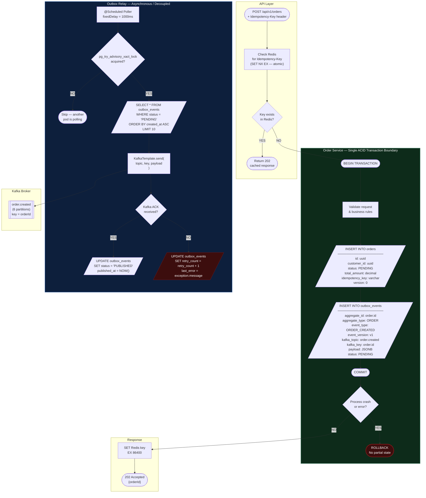
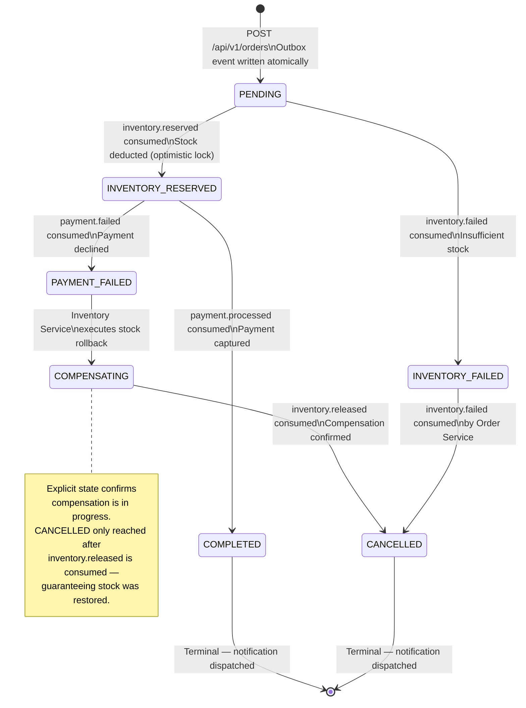

# Order Processing System

### A Production-Grade Event-Driven Microservices Architecture

---

## Table of Contents

1. [Project Overview](#project-overview)
2. [Architecture Philosophy](#architecture-philosophy)
3. [System Architecture](#system-architecture)
4. [Service Breakdown](#service-breakdown)
5. [Distributed Patterns Deep Dive](#distributed-patterns-deep-dive)
6. [Data Architecture](#data-architecture)
7. [Kafka Topic Design](#kafka-topic-design)
8. [Event Envelope Specification](#event-envelope-specification)
9. [Observability Strategy](#observability-strategy)
10. [Resilience Strategy](#resilience-strategy)
11. [Local Development Setup](#local-development-setup)
12. [API Reference](#api-reference)
13. [Configuration Reference](#configuration-reference)
14. [Tech Stack](#tech-stack)

---

## Project Overview

This system is a fully event-driven, microservices-based order processing platform built to production-grade standards. It handles the complete lifecycle of an e-commerce order — from creation through inventory reservation and payment capture to final confirmation — using asynchronous event choreography across independent, isolated services.

The core engineering challenge this system solves is **distributed consistency without distributed transactions**. Each service owns its data exclusively. No service calls another over HTTP at runtime. Consistency across the system is achieved through the Saga pattern, compensating transactions, and strict idempotency guarantees at every message boundary.

This is a **polyglot architecture** — four services are built in Java 21 with Spring Boot 4.1.0, and the Notification Service is built in Go. The language choice for each service is deliberate: Go's goroutine concurrency model is better suited to the Notification Service's purely I/O-bound, high-throughput consumption workload.

**What this system demonstrates end-to-end:**

- Atomic event publication using the Transactional Outbox Pattern, eliminating the dual-write problem entirely
- Distributed saga choreography across three independent business domains
- Two-layer idempotency (Redis + database constraints) protecting every Kafka consumer from duplicate processing
- Optimistic locking preventing inventory oversell under concurrent load
- Compensating transactions automatically restoring consistency when payment fails
- Full distributed tracing with a single correlation ID flowing from HTTP ingress through every Kafka hop
- Circuit breakers and retry policies preventing cascade failures
- Polyglot microservices — Java/Spring for domain-heavy services, Go for high-throughput I/O consumers

---

## Architecture Philosophy

### Why Event-Driven over REST Orchestration

A synchronous REST-based architecture for order processing would require the Order Service to directly call Inventory Service and Payment Service over HTTP. This creates three critical problems:

**Temporal coupling**: if Inventory Service is down, Order Service cannot function — even though creating an order and reserving inventory are logically separable concerns.

**Cascading failures**: a slow Payment Service response blocks Order Service threads, which backs up the request queue, which causes the API Gateway to timeout, which cascades to the client.

**Tight deployment coupling**: every service must be deployed and healthy simultaneously. A rolling deployment of Inventory Service causes failures in Order Service.

The event-driven approach inverts this. Order Service writes its intent to Kafka and returns immediately. Inventory Service processes that intent when it is ready. The two services have zero runtime dependency on each other. Each can be deployed, scaled, and restarted independently.

### Why Choreography over Orchestration

An orchestrated saga requires a central coordinator — typically a dedicated Saga Orchestrator service — that explicitly calls each participant in sequence and manages the overall workflow state. This solves one problem (coordination) while introducing another: the orchestrator becomes a single point of failure and a bottleneck for all order flows.

Choreography distributes the coordination logic into each service. The Inventory Service knows: "when I see an `order.created` event, I reserve stock and publish the outcome." The Payment Service knows: "when I see an `inventory.reserved` event, I process payment." No service has global knowledge. Each service is fully autonomous. The workflow emerges from the combination of reactions.

The tradeoff is that the overall flow is harder to visualise from any single service's code — which is precisely why the sequence diagrams and this documentation exist.

### Why Go for Notification Service

Notification Service is a pure I/O-bound consumer — it reads from Kafka and dispatches outbound calls. It has no database, no complex business logic, no ORM. Go's goroutine model handles thousands of concurrent I/O operations at a fraction of the memory cost of JVM threads. A Go goroutine starts with ~2KB of stack versus ~512KB for a Java thread. The compiled binary starts in under 100ms and idles at ~15MB — compared to 2-3 seconds startup and ~200MB idle for an equivalent Spring Boot service. For a stateless, high-throughput consumer, Go is the operationally correct choice. This decision also demonstrates that language selection should follow the problem, not default to a single stack.

---

## System Architecture

### High-Level Component Topology

```mermaid
graph TB
    subgraph CLIENT["Client Layer"]
        C(["fa:fa-user Client / Mobile App"])
    end

    subgraph GATEWAY["API Gateway Layer  •  Spring Cloud Gateway"]
        GW["API Gateway\n────────────────\n› Route Resolution\n› Rate Limiting (Redis)\n› Correlation ID Injection\n› JWT Validation"]
    end

    subgraph SERVICES["Microservices Layer"]
        direction TB

        subgraph OS_BOX["Order Service  •  Java 21 / Spring Boot  •  :8081"]
            OS["Order Service\n────────────────\n› Create Order\n› Outbox Poller\n› Status Updater"]
        end

        subgraph IS_BOX["Inventory Service  •  Java 21 / Spring Boot  •  :8082"]
            IS["Inventory Service\n────────────────\n› Reserve Stock\n› Release Stock\n› Optimistic Locking"]
        end

        subgraph PS_BOX["Payment Service  •  Java 21 / Spring Boot  •  :8083"]
            PS["Payment Service\n────────────────\n› Process Payment\n› Refund Payment\n› Idempotency Guard"]
        end

        subgraph NS_BOX["Notification Service  •  Go  •  :8084"]
            NS["Notification Service\n────────────────\n› Email Dispatch\n› SMS Dispatch\n› Terminal Event Listener\n› Goroutine-based concurrency"]
        end
    end

    subgraph MESSAGING["Messaging Layer  •  Apache Kafka Cluster (KRaft)"]
        direction LR
        T1[["order.created"]]
        T2[["inventory.reserved"]]
        T3[["inventory.failed"]]
        T4[["payment.processed"]]
        T5[["payment.failed"]]
        T6[["inventory.released"]]
        DLQ1[["inventory.events.DLQ"]]
        DLQ2[["payment.events.DLQ"]]
    end

    subgraph DATA["Data Layer"]
        direction TB

        subgraph ODB["orders_db  •  PostgreSQL :5432"]
            OT[("orders\norder_items\noutbox_events")]
        end

        subgraph IDB["inventory_db  •  PostgreSQL :5433"]
            IT[("products\ninventory_reservations")]
        end

        subgraph PDB["payments_db  •  PostgreSQL :5434"]
            PT[("payments")]
        end

        REDIS[("Redis :6379\n────────────\nIdempotency Keys\nRate Limit Counters")]
    end

    subgraph OBS["Observability Stack"]
        PROM["Prometheus\n:9090"]
        GRAF["Grafana\n:3000"]
        ZIPKIN["Zipkin\n:9411"]
    end

    C -->|"HTTPS + Idempotency-Key header"| GW
    GW -->|"POST /api/v1/orders"| OS
    GW -->|"Rate limit state"| REDIS
    OS -->|"Atomic write\n(same transaction)"| OT
    OS -->|"Publishes via\nOutbox Poller"| T1
    OS -->|"Consumes to update status"| T3
    OS -->|"Consumes to update status"| T4
    OS -->|"Consumes to update status"| T5
    IS -->|"Reads/writes\nstock & reservations"| IT
    IS -->|"Consumes"| T1
    IS -->|"Publishes on success"| T2
    IS -->|"Publishes on failure"| T3
    IS -->|"Consumes for rollback"| T5
    IS -->|"Publishes after compensation"| T6
    IS -->|"Max retries exceeded"| DLQ1
    PS -->|"Reads/writes\npayment records"| PT
    PS -->|"Consumes"| T2
    PS -->|"Publishes on success"| T4
    PS -->|"Publishes on failure"| T5
    PS -->|"Max retries exceeded"| DLQ2
    NS -->|"Consumes terminal events"| T3
    NS -->|"Consumes terminal events"| T4
    NS -->|"Consumes terminal events"| T5
    IS & PS & OS -->|"Idempotency key\ncheck & store"| REDIS
    OS & IS & PS & NS -->|"Metrics\n/actuator/prometheus or /metrics"| PROM
    PROM --> GRAF
    OS & IS & PS -->|"Trace spans\nvia Micrometer"| ZIPKIN
```



---

## Service Breakdown

### API Gateway — Port 8080 — Java / Spring Cloud Gateway

The single ingress point for all client traffic. Built on Spring Cloud Gateway (reactive, Netty-based — intentionally has no Spring Web dependency).

**Responsibilities:**

- Route resolution: maps incoming paths to the correct downstream service
- Rate limiting: enforces request quotas per IP using Redis as the counter store
- Correlation ID injection: generates and injects `X-Correlation-ID` if absent — this ID propagates through every downstream service and every Kafka message
- Idempotency-Key validation: ensures the header is present on state-mutating endpoints before forwarding

**What it does not do:** business logic, database access, or Kafka interaction.

---

### Order Service — Port 8081 — Java 21 / Spring Boot 4.1.0

The entry point for business logic. Owns the `orders_db` PostgreSQL instance exclusively.

**Responsibilities:**

- Accept `POST /api/v1/orders` requests
- Validate the request payload and the `Idempotency-Key` header
- Execute the transactional outbox write — the most critical operation in the system
- Run the Outbox Poller with PostgreSQL advisory lock for safe horizontal scaling
- Consume terminal-state events from Kafka to update order status

**Key design constraint:** Order Service never calls Inventory Service or Payment Service. It publishes its intent and later learns the outcome by consuming events. The API returns `202 Accepted` — not `200 OK` — because the order outcome is not known at response time.

**Tables owned:** `orders`, `order_items`, `outbox_events`

---

### Inventory Service — Port 8082 — Java 21 / Spring Boot 4.1.0

Responsible for stock management. Owns the `inventory_db` PostgreSQL instance exclusively.

**Responsibilities:**

- Consume `order.created` events and attempt to reserve stock
- Use optimistic locking (`@Version` column) on the `products` table to prevent oversell under concurrency
- Publish `inventory.reserved` on success or `inventory.failed` on insufficient stock
- Consume `payment.failed` events and execute the compensating transaction — release reserved stock
- Publish `inventory.released` after compensation completes, allowing Order Service to transition to `CANCELLED`

**Key design constraint:** Inventory Service has no knowledge of Payment Service internals. It reacts to `payment.failed` purely because it has subscribed to that topic.

**Tables owned:** `products`, `inventory_reservations`

---

### Payment Service — Port 8083 — Java 21 / Spring Boot 4.1.0

Responsible for payment capture. Owns the `payments_db` PostgreSQL instance exclusively.

**Responsibilities:**

- Consume `inventory.reserved` events and attempt to process payment
- Insert a payment record before attempting the charge — the UNIQUE constraint on `order_id` provides database-level idempotency
- Publish `payment.processed` on success or `payment.failed` on decline
- Apply two-layer idempotency: Redis fast path + database constraint

**Key design constraint:** Payment Service only acts after inventory is confirmed reserved. It never charges a customer for an order where stock could not be guaranteed.

**Tables owned:** `payments`

---

### Notification Service — Port 8084 — Go

A stateless, high-throughput event consumer. Owns no database. Intentionally built in Go to demonstrate polyglot architecture and to leverage Go's goroutine concurrency model for I/O-bound workloads.

**Responsibilities:**

- Consume terminal-state events: `inventory.failed`, `payment.processed`, `payment.failed`
- Dispatch mock email and SMS notifications appropriate to each outcome
- Structured JSON logging via `zerolog`
- Expose `/health` endpoint for Docker and orchestrator healthchecks
- Graceful shutdown on `SIGTERM` — drains in-flight goroutines before exit

**Why Go specifically:** this service performs no database writes and has no complex business logic. It is pure I/O — read from Kafka, write to an external notification provider. Go goroutines handle this workload with ~2KB stack per goroutine versus ~512KB per Java thread. The service compiles to a single 8MB binary, starts in under 100ms, and idles at ~15MB memory.

**Key design constraint:** Notification Service is a pure consumer with no outbound Kafka publishing. Its failure has zero impact on any other service's operation or the saga's correctness.

---

## Distributed Patterns Deep Dive

### The Transactional Outbox Pattern



#### The Problem It Solves

The naive approach to publishing events is:

```
1. Save order to PostgreSQL   ← succeeds
2. Publish event to Kafka     ← process crashes here
```

The order exists in the database. The event never reaches Kafka. Inventory Service never sees it. The order is permanently stuck in `PENDING`. There is no automatic recovery.

The alternative naive approach has the same problem in reverse:

```
1. Publish event to Kafka     ← succeeds
2. Save order to PostgreSQL   ← process crashes here
```

The event is in Kafka. Inventory Service acts on it. But no order record exists. The database and event stream are inconsistent.

#### How the Outbox Pattern Solves It

The outbox table lives inside the same database as the orders table. Writing to both in a single ACID transaction means they are always consistent — either both writes succeed or neither does. The `outbox_events` table is a guaranteed local buffer. The poller reads from it and publishes to Kafka asynchronously. If the poller crashes after publishing but before marking as published, the event is published again on the next cycle — acceptable because all consumers are idempotent.

#### The Advisory Lock

`pg_try_advisory_xact_lock` is a PostgreSQL transaction-scoped non-blocking lock. If Pod A holds it, Pod B gets `false` immediately and skips that cycle. The lock releases automatically when the transaction commits. This gives safe horizontal scaling of the Order Service with zero external infrastructure.

---

### The Saga Pattern — Choreography

```mermaid
sequenceDiagram
    autonumber

    actor Client
    participant GW as API Gateway
    participant OS as Order Service
    participant ODB as orders_db
    participant K as Kafka
    participant IS as Inventory Service
    participant IDB as inventory_db
    participant PS as Payment Service
    participant PDB as payments_db
    participant NS as Notification Service (Go)
    participant RD as Redis

    Note over Client, RD: ═══════════════ HAPPY PATH ═══════════════

    Client->>GW: POST /api/v1/orders {Idempotency-Key: uuid}
    GW->>RD: SET NX idempotency:{key} (atomic check-and-set)
    RD-->>GW: nil — new request, lock acquired
    GW->>OS: Forward request

    rect rgb(20, 60, 40)
        Note over OS, ODB: Single ACID Transaction (Outbox Pattern)
        OS->>ODB: INSERT INTO orders (status=PENDING)
        OS->>ODB: INSERT INTO outbox_events (status=PENDING, topic=order.created)
        ODB-->>OS: COMMIT
    end

    OS-->>GW: 202 Accepted {orderId}
    GW-->>Client: 202 Accepted {orderId}

    rect rgb(20, 40, 70)
        Note over OS, K: Async — Outbox Poller (advisory lock held)
        OS->>ODB: SELECT pending outbox events
        OS->>K: PUBLISH → order.created {orderId, items, amount}
        OS->>ODB: UPDATE outbox_events SET status=PUBLISHED
    end

    K->>IS: CONSUME order.created
    IS->>RD: SET NX idempotent:inventory:{eventId} (atomic)
    RD-->>IS: nil — not duplicate

    rect rgb(20, 60, 40)
        Note over IS, IDB: Optimistic Locking — prevents oversell
        IS->>IDB: UPDATE products SET qty = qty - N WHERE version = V
        IDB-->>IS: 1 row updated (version bumped)
        IS->>IDB: INSERT INTO inventory_reservations (order_id, status=RESERVED)
    end

    IS->>K: PUBLISH → inventory.reserved {orderId}

    K->>PS: CONSUME inventory.reserved
    PS->>RD: SET NX idempotent:payment:{eventId} (atomic)
    RD-->>PS: nil — not duplicate

    rect rgb(20, 60, 40)
        Note over PS, PDB: Payment Processing
        PS->>PDB: INSERT INTO payments (order_id, status=PENDING)
        Note over PS: Call payment gateway (mocked)
        PS->>PDB: UPDATE payments SET status=SUCCESS
    end

    PS->>K: PUBLISH → payment.processed {orderId}

    K->>OS: CONSUME payment.processed
    OS->>ODB: UPDATE orders SET status=COMPLETED

    K->>NS: CONSUME payment.processed
    NS-->>Client: Email — Order confirmed

    Note over Client, RD: ════════ COMPENSATING TRANSACTION PATH (Payment Failure) ════════

    PS->>PDB: UPDATE payments SET status=FAILED, reason=DECLINED
    PS->>K: PUBLISH → payment.failed {orderId, reason}

    K->>IS: CONSUME payment.failed
    Note over IS: Compensating Transaction — Rollback Stock

    rect rgb(80, 20, 20)
        IS->>IDB: UPDATE products SET qty = qty + N
        IS->>IDB: UPDATE inventory_reservations SET status=RELEASED
    end

    IS->>K: PUBLISH → inventory.released {orderId}

    K->>OS: CONSUME inventory.released
    OS->>ODB: UPDATE orders SET status=CANCELLED

    K->>OS: CONSUME payment.failed
    OS->>ODB: UPDATE orders SET status=PAYMENT_FAILED

    K->>NS: CONSUME payment.failed
    NS-->>Client: Email — Payment failed
```



#### Eventual Consistency

When the client receives `202 Accepted`, the order is in `PENDING`. The final outcome is determined asynchronously as events flow through Kafka. The client polls `GET /api/v1/orders/{orderId}` or awaits a push notification for the terminal state. This is the fundamental contract of any event-driven system exposed to synchronous clients.

#### Compensating Transactions vs. Rollback

A database rollback undoes uncommitted work atomically. Compensating transactions are the distributed equivalent — new forward-moving operations that semantically undo previously committed work across independent service boundaries. When Payment Service publishes `payment.failed`, Inventory Service executes a new committed transaction to restore stock. The `inventory.released` event then signals Order Service to move to `CANCELLED` — a clean, consistent terminal state.

---

### Idempotency — Two-Layer Defence

Kafka provides at-least-once delivery. Under rebalance, crash recovery, or broker leader election, the same message can be delivered more than once. Every consumer must handle this safely.

**Layer 1 — Redis atomic SET NX EX (fast path):**
`SET key value NX EX ttl` is a single atomic Redis operation. Only one concurrent thread can win it. The consumer checks this before any business logic. If the key exists, the event is a duplicate — discard immediately with no database access.

**Layer 2 — Database UNIQUE constraint (correctness guarantee):**
Handles events delivered after the Redis TTL expires and the race window between DB commit and Redis write. `inventory_reservations.order_id` and `payments.order_id` have UNIQUE constraints. A duplicate insert raises a constraint violation caught and treated as a successful no-op.

If Redis is unavailable, the system falls back to database-only idempotency — slower but still correct. Redis is a performance optimisation. The database is the correctness boundary.

---

## Data Architecture

### Database-per-Service Pattern

Each service owns its own PostgreSQL instance exclusively. This is not a preference — it is an architectural constraint enforcing service autonomy.

**Enforcement rules:**

- No service imports another service's JPA entities
- No cross-database foreign keys anywhere in the system
- No shared schema or shared connection pool
- Cross-service data needs are satisfied through event payloads or read-only HTTP calls — never shared writes

### Order Service Schema

```sql
CREATE EXTENSION IF NOT EXISTS "uuid-ossp";

CREATE TABLE orders (
    id                  UUID            PRIMARY KEY DEFAULT uuid_generate_v4(),
    customer_id         UUID            NOT NULL,
    idempotency_key     VARCHAR(255)    NOT NULL,
    status              VARCHAR(50)     NOT NULL DEFAULT 'PENDING',
    total_amount        NUMERIC(19, 4)  NOT NULL,
    currency            CHAR(3)         NOT NULL DEFAULT 'INR',
    created_at          TIMESTAMPTZ     NOT NULL DEFAULT NOW(),
    updated_at          TIMESTAMPTZ     NOT NULL DEFAULT NOW(),
    version             BIGINT          NOT NULL DEFAULT 0,
    CONSTRAINT chk_orders_status CHECK (
        status IN ('PENDING', 'INVENTORY_RESERVED', 'INVENTORY_FAILED',
                   'COMPENSATING', 'PAYMENT_FAILED', 'COMPLETED', 'CANCELLED')
    ),
    CONSTRAINT uq_orders_idempotency_key UNIQUE (idempotency_key)
);

CREATE TABLE order_items (
    id              UUID            PRIMARY KEY DEFAULT uuid_generate_v4(),
    order_id        UUID            NOT NULL REFERENCES orders(id) ON DELETE CASCADE,
    product_id      UUID            NOT NULL,
    product_name    VARCHAR(500)    NOT NULL,
    quantity        INT             NOT NULL,
    unit_price      NUMERIC(19, 4)  NOT NULL,
    total_price     NUMERIC(19, 4)  NOT NULL,
    CONSTRAINT chk_order_items_quantity CHECK (quantity > 0)
);

CREATE TABLE outbox_events (
    id              UUID            PRIMARY KEY DEFAULT uuid_generate_v4(),
    aggregate_id    UUID            NOT NULL,
    aggregate_type  VARCHAR(100)    NOT NULL,
    event_type      VARCHAR(100)    NOT NULL,
    event_version   VARCHAR(10)     NOT NULL DEFAULT 'v1',
    payload         JSONB           NOT NULL,
    status          VARCHAR(20)     NOT NULL DEFAULT 'PENDING',
    kafka_topic     VARCHAR(255)    NOT NULL,
    kafka_key       VARCHAR(255),
    created_at      TIMESTAMPTZ     NOT NULL DEFAULT NOW(),
    published_at    TIMESTAMPTZ,
    retry_count     INT             NOT NULL DEFAULT 0,
    last_error      TEXT,
    CONSTRAINT chk_outbox_status CHECK (status IN ('PENDING', 'PUBLISHED', 'FAILED'))
);

CREATE INDEX idx_outbox_pending ON outbox_events (created_at ASC) WHERE status = 'PENDING';
CREATE INDEX idx_orders_customer_id ON orders (customer_id);
CREATE INDEX idx_orders_status ON orders (status);
```

### Inventory Service Schema

```sql
CREATE TABLE products (
    id                  UUID            PRIMARY KEY DEFAULT uuid_generate_v4(),
    name                VARCHAR(500)    NOT NULL,
    sku                 VARCHAR(100)    NOT NULL UNIQUE,
    available_quantity  INT             NOT NULL DEFAULT 0,
    reserved_quantity   INT             NOT NULL DEFAULT 0,
    version             BIGINT          NOT NULL DEFAULT 0,
    CONSTRAINT chk_products_qty CHECK (available_quantity >= 0)
);

CREATE TABLE inventory_reservations (
    id          UUID            PRIMARY KEY DEFAULT uuid_generate_v4(),
    order_id    UUID            NOT NULL UNIQUE,
    product_id  UUID            NOT NULL REFERENCES products(id),
    quantity    INT             NOT NULL,
    status      VARCHAR(20)     NOT NULL DEFAULT 'RESERVED',
    created_at  TIMESTAMPTZ     NOT NULL DEFAULT NOW(),
    updated_at  TIMESTAMPTZ     NOT NULL DEFAULT NOW(),
    CONSTRAINT chk_reservation_status CHECK (status IN ('RESERVED', 'RELEASED', 'CONSUMED'))
);
```

### Payment Service Schema

```sql
CREATE TABLE payments (
    id              UUID            PRIMARY KEY DEFAULT uuid_generate_v4(),
    order_id        UUID            NOT NULL UNIQUE,
    customer_id     UUID            NOT NULL,
    amount          NUMERIC(19, 4)  NOT NULL,
    currency        CHAR(3)         NOT NULL DEFAULT 'INR',
    status          VARCHAR(20)     NOT NULL DEFAULT 'PENDING',
    failure_reason  VARCHAR(500),
    created_at      TIMESTAMPTZ     NOT NULL DEFAULT NOW(),
    updated_at      TIMESTAMPTZ     NOT NULL DEFAULT NOW(),
    CONSTRAINT chk_payment_status CHECK (status IN ('PENDING', 'SUCCESS', 'FAILED'))
);
```

---

## Order Lifecycle — State Machine



#### State Transition Rules

| From State           | Event Consumed          | To State             | Actor         |
| -------------------- | ----------------------- | -------------------- | ------------- |
| _(new)_              | `POST /api/v1/orders`   | `PENDING`            | Order Service |
| `PENDING`            | `inventory.reserved`    | `INVENTORY_RESERVED` | Order Service |
| `PENDING`            | `inventory.failed`      | `INVENTORY_FAILED`   | Order Service |
| `INVENTORY_RESERVED` | `payment.processed`     | `COMPLETED`          | Order Service |
| `INVENTORY_RESERVED` | `payment.failed`        | `PAYMENT_FAILED`     | Order Service |
| `PAYMENT_FAILED`     | _(internal transition)_ | `COMPENSATING`       | Order Service |
| `COMPENSATING`       | `inventory.released`    | `CANCELLED`          | Order Service |
| `INVENTORY_FAILED`   | _(immediately)_         | `CANCELLED`          | Order Service |

`COMPLETED` and `CANCELLED` are terminal states. No further transitions are permitted.

---

## Kafka Topic Design

| Topic                  | Partitions | Retention | Partition Key | Publisher           | Consumers                                              |
| ---------------------- | ---------- | --------- | ------------- | ------------------- | ------------------------------------------------------ |
| `order.created`        | 6          | 7 days    | `orderId`     | Order Service       | Inventory Service                                      |
| `inventory.reserved`   | 6          | 7 days    | `orderId`     | Inventory Service   | Payment Service, Order Service                         |
| `inventory.failed`     | 6          | 7 days    | `orderId`     | Inventory Service   | Order Service, Notification Service                    |
| `inventory.released`   | 6          | 7 days    | `orderId`     | Inventory Service   | Order Service                                          |
| `payment.processed`    | 6          | 7 days    | `orderId`     | Payment Service     | Order Service, Notification Service                    |
| `payment.failed`       | 6          | 7 days    | `orderId`     | Payment Service     | Inventory Service, Order Service, Notification Service |
| `order.created.DLQ`    | 1          | 30 days   | `orderId`     | Kafka Error Handler | Ops / manual replay                                    |
| `inventory.events.DLQ` | 1          | 30 days   | `orderId`     | Kafka Error Handler | Ops / manual replay                                    |
| `payment.events.DLQ`   | 1          | 30 days   | `orderId`     | Kafka Error Handler | Ops / manual replay                                    |

#### Why 6 Partitions

Six allows up to 6 parallel consumer instances per consumer group. Divisible by 2 and 3 — clean scaling to 2, 3, or 6 pods with balanced partition assignment. Partition count cannot be reduced after creation without topic recreation.

#### Why `orderId` as the Partition Key

Kafka guarantees ordering within a single partition. Keying on `orderId` ensures all events for the same order land on the same partition and are consumed in production order — preventing a consumer from processing `payment.processed` before `inventory.reserved` for the same order.

#### Why DLQ Topics Have 1 Partition

DLQ traffic is low-volume by design. Single partition simplifies tooling and allows sequential manual replay without ordering concerns.

---

## Event Envelope Specification

Every Kafka message in this system — across all services, in all languages — uses this JSON structure.

```json
{
  "eventId": "b2e4f8a1-3c7d-4e9f-8a1b-2c3d4e5f6a7b",
  "eventType": "ORDER_CREATED",
  "eventVersion": "v1",
  "aggregateId": "a1b2c3d4-e5f6-7a8b-9c0d-e1f2a3b4c5d6",
  "aggregateType": "ORDER",
  "correlationId": "f1e2d3c4-b5a6-7f8e-9d0c-b1a2f3e4d5c6",
  "causationId": "e1d2c3b4-a5f6-7e8d-9c0b-a1f2e3d4c5b6",
  "occurredAt": "2026-08-15T10:30:00.000Z",
  "producer": "order-service",
  "payload": {}
}
```

| Field           | Type     | Purpose                                                                                                         |
| --------------- | -------- | --------------------------------------------------------------------------------------------------------------- |
| `eventId`       | UUID     | Unique per event instance. Used as the idempotency key by all consumers.                                        |
| `eventType`     | String   | Semantic event name. Consumers switch on this field.                                                            |
| `eventVersion`  | String   | Schema version. Consumers handle `v1` and `v2` conditionally — no coordinated flag day needed.                  |
| `aggregateId`   | UUID     | ID of the domain object — typically `orderId`.                                                                  |
| `aggregateType` | String   | Domain category. Useful for generic processors and audit logs.                                                  |
| `correlationId` | UUID     | Original HTTP request ID. Injected by API Gateway. Propagated unchanged through every event and every log line. |
| `causationId`   | UUID     | `eventId` of the event that caused this one. Enables full causal chain reconstruction from logs alone.          |
| `occurredAt`    | ISO 8601 | Business timestamp. Not the Kafka ingestion timestamp.                                                          |
| `producer`      | String   | Originating service. Essential for DLQ triage.                                                                  |
| `payload`       | Object   | Domain-specific data, varying by `eventType`.                                                                   |

---

## Observability Strategy

### Distributed Tracing — Zipkin

Every HTTP request gets a `traceId` at the API Gateway. Micrometer's Brave bridge propagates it via B3 headers on HTTP calls and Kafka message headers on every published event. The Go Notification Service extracts the `correlationId` from the event envelope and logs it with every line — achieving the same observability without the JVM tracing bridge.

In Zipkin at `http://localhost:9411`, a completed order shows the full span tree across all services with per-step latency.

### Metrics — Prometheus + Grafana

All Java services expose `/actuator/prometheus`. The Go Notification Service exposes `/metrics` in the same Prometheus exposition format. Prometheus scrapes all services every 15 seconds.

| Metric                                   | Type      | Meaning                                                              |
| ---------------------------------------- | --------- | -------------------------------------------------------------------- |
| `orders_created_total`                   | Counter   | Orders accepted                                                      |
| `orders_completed_total`                 | Counter   | Orders reaching COMPLETED                                            |
| `orders_failed_total`                    | Counter   | Orders reaching CANCELLED                                            |
| `outbox_events_pending`                  | Gauge     | Unpublished outbox backlog — spikes indicate Kafka issues            |
| `kafka_consumer_lag`                     | Gauge     | Consumer group lag — spikes indicate slow consumer or poison message |
| `inventory_reservation_duration_seconds` | Histogram | P50/P95/P99 reservation latency                                      |
| `payment_processing_duration_seconds`    | Histogram | P50/P95/P99 payment latency                                          |
| `resilience4j_circuitbreaker_state`      | Gauge     | 0=CLOSED, 1=OPEN, 2=HALF_OPEN                                        |

### Structured Logging

Java services use Logback with JSON output. The Go service uses `zerolog` with JSON output. Every log line across every service includes `traceId`, `correlationId`, and `orderId` in the MDC or zerolog context. Any log aggregation tool can filter the complete journey of a single order across all services with one `correlationId` query.

---

## Resilience Strategy

### Circuit Breakers — Resilience4j

Applied to external dependency calls in Java services — primarily the mock payment gateway in Payment Service. Three states: CLOSED (normal), OPEN (failing fast after threshold), HALF_OPEN (probing recovery). Threshold: 50% failure rate over 10 calls. Wait duration: 30 seconds before probing.

During OPEN state, Payment Service publishes `payment.failed` immediately, triggering the compensation path rather than holding threads waiting on a broken dependency.

### Retry Policy

Spring Kafka's `DefaultErrorHandler` with exponential backoff on Java consumers:

- Attempt 1: immediate
- Attempt 2: 1 second delay
- Attempt 3: 2 second delay
- After 3 failures: route to DLQ with error headers

The Go consumer implements equivalent retry logic using a backoff loop before committing the failed message offset to the DLQ topic.

### Idempotency as a Resilience Tool

Idempotency and resilience are inseparable. The ability to safely retry any operation — Kafka re-delivery, HTTP retry, pod restart — without duplicate side effects is what makes the retry strategy safe. Without idempotency, retries corrupt data. With it, retries are free resilience.

---

## Local Development Setup

### Prerequisites

| Tool     | Version | Notes                   |
| -------- | ------- | ----------------------- |
| Java     | 21      | `java -version`         |
| Maven    | 3.9+    | `mvn -version`          |
| Go       | 1.22+   | `go version`            |
| OrbStack | Latest  | Docker runtime on macOS |
| Git      | Any     |                         |

### 1. Clone the Repository

```bash
git clone https://github.com/YOUR_USERNAME/order-processing-system.git
cd order-processing-system
```

### 2. Start Infrastructure

```bash
cd infra
docker compose up -d
docker compose ps   # all containers: healthy
```

### 3. Run Java Services

```bash
cd order-service      && ./mvnw spring-boot:run  # Tab 1
cd inventory-service  && ./mvnw spring-boot:run  # Tab 2
cd payment-service    && ./mvnw spring-boot:run  # Tab 3
```

### 4. Run Go Notification Service

```bash
cd notification-service
go run ./cmd/main.go   # Tab 4
```

### 5. Observability UIs

| UI         | URL                   | Credentials   |
| ---------- | --------------------- | ------------- |
| Zipkin     | http://localhost:9411 | None          |
| Prometheus | http://localhost:9090 | None          |
| Grafana    | http://localhost:3000 | admin / admin |

### 6. Place a Test Order

```bash
curl -X POST http://localhost:8080/api/v1/orders \
  -H "Content-Type: application/json" \
  -H "Idempotency-Key: $(uuidgen)" \
  -d '{
    "customerId": "a0000000-0000-0000-0000-000000000001",
    "items": [
      {
        "productId":   "b0000000-0000-0000-0000-000000000001",
        "productName": "Wireless Headphones",
        "quantity":    2,
        "unitPrice":   1299.99
      }
    ],
    "currency": "INR"
  }'
```

Poll for status:

```bash
curl http://localhost:8080/api/v1/orders/{orderId}
```

---

## API Reference

### Create Order

```
POST /api/v1/orders
```

| Header             | Required | Description                                                                       |
| ------------------ | -------- | --------------------------------------------------------------------------------- |
| `Content-Type`     | Yes      | `application/json`                                                                |
| `Idempotency-Key`  | Yes      | Client UUID. Same key within 24 hours returns same response without reprocessing. |
| `X-Correlation-ID` | No       | Injected by API Gateway if absent.                                                |

| Status                  | Meaning                                   |
| ----------------------- | ----------------------------------------- |
| `202 Accepted`          | Order accepted, processing asynchronously |
| `400 Bad Request`       | Validation failure                        |
| `409 Conflict`          | Idempotency-Key already used              |
| `429 Too Many Requests` | Rate limit exceeded                       |

### Get Order Status

```
GET /api/v1/orders/{orderId}
```

Returns current order state including status, items, and timestamps.

---

## Architecture Decision Records

| Decision                         | Choice                                  | Rationale                                                                                                |
| -------------------------------- | --------------------------------------- | -------------------------------------------------------------------------------------------------------- |
| Inter-service communication      | Kafka events (async)                    | Eliminates runtime coupling. Services survive each other's downtime.                                     |
| Dual-write solution              | Transactional Outbox Pattern            | Atomic DB write + event publication without distributed transactions.                                    |
| Distributed transaction strategy | Saga — Choreography                     | No central orchestrator, no single point of failure. Each service owns its step and its rollback.        |
| Consumer deduplication           | Redis SET NX EX + DB UNIQUE constraints | Atomic fast path in Redis; DB constraint as correctness guarantee that survives Redis unavailability.    |
| Inventory race condition         | Optimistic locking (`@Version`)         | Prevents oversell without pessimistic locks that would serialise all writes.                             |
| Outbox multi-pod safety          | PostgreSQL advisory locks               | Safe horizontal scaling with zero external coordination infrastructure.                                  |
| Schema evolution                 | `eventVersion` in all event envelopes   | Conditional handling of v1/v2 payloads — no coordinated deployment required.                             |
| API response for order creation  | `202 Accepted`                          | Outcome unknown at response time. Correct HTTP semantic for async acceptance.                            |
| Partition key                    | `orderId`                               | Per-order event ordering guaranteed within each topic.                                                   |
| Compensation acknowledgement     | `inventory.released` topic              | Explicit event confirms stock was restored before order moves to CANCELLED. Closes the compensation gap. |
| Notification Service language    | Go                                      | I/O-bound, stateless consumer — goroutine model and minimal memory footprint are operationally correct.  |

---

## Tech Stack

| Category                  | Technology                     | Version           |
| ------------------------- | ------------------------------ | ----------------- |
| Language (services)       | Java                           | 21                |
| Language (notification)   | Go                             | 1.22+             |
| Framework                 | Spring Boot                    | 4.1.0             |
| API Gateway               | Spring Cloud Gateway           | Latest compatible |
| Messaging                 | Apache Kafka (KRaft)           | Confluent 7.7.0   |
| Primary Database          | PostgreSQL                     | 16                |
| Cache / Idempotency Store | Redis                          | 7.2               |
| Resilience                | Resilience4j                   | Latest compatible |
| Metrics                   | Micrometer + Prometheus        | Latest compatible |
| Distributed Tracing       | Micrometer Tracing + Zipkin    | Latest compatible |
| Go Kafka Client           | segmentio/kafka-go             | Latest            |
| Go Logging                | rs/zerolog                     | Latest            |
| Dashboards                | Grafana                        | 10.4.x            |
| Database Migrations       | Flyway                         | Latest compatible |
| Containerisation          | Docker + Docker Compose        | OrbStack on macOS |
| Integration Testing       | Testcontainers                 | Latest compatible |
| Build Tool                | Maven (Java) / Go modules (Go) | 3.9+ / 1.22+      |
